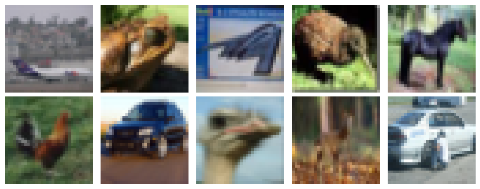
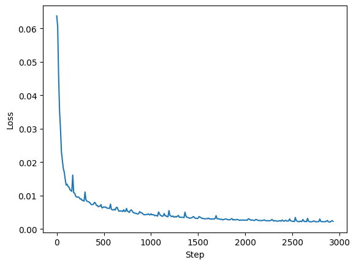
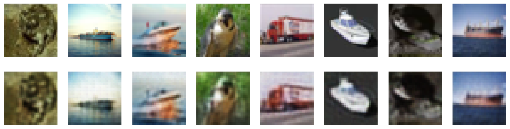

# Autoencoder: Distributed Training with Taktiny

[Open in Kaggle](https://www.kaggle.com/code/shinapridelucania/autoencoder-distributed-training-with-taktiny)

In this tutorial, we'll train a simple autoencoder on Kaggle using two T4 GPUs.

```bash
%pip install git+https://github.com/solitariusai/taktiny.git@experiment
%pip install -U 'jax[cuda]==0.11.1'
```

Taktiny uses Qwix, which depends on Flax. If a JAX update removes an API that the installed Flax version still uses, importing Taktiny may fail. In that case, install a JAX version compatible with Qwix and Flax.

## 1. Import Packages

```py
from datasets import load_dataset
import jax.numpy as jnp, jax
from jax.sharding import PartitionSpec as P
import matplotlib.pyplot as plt
import optax
import numpy as np
import time
import grain.python as grain

from taktiny import nn
from taktiny.data import DataLoader, BatchMap
from taktiny.takt import Optimizer

jax.devices()
```
```
[CudaDevice(id=0), CudaDevice(id=1)]
```

On Kaggle, `jax.devices()` should show two CUDA devices if you selected the T4 x2 accelerator.

## 2. Prepare Dataset

We'll load `uoft-cs/cifar10` from Hugging Face with `load_dataset`.

```py
dataset = load_dataset('uoft-cs/cifar10')

fig, axes = plt.subplots(2, 5, figsize=(10, 4))
for i, ax in enumerate(axes.flat):
    ax.imshow(dataset['train'][i]['img'])
    ax.axis("off")

plt.tight_layout()
plt.show()
```

Plot a few examples to see what the images look like.



```py
batch_size = 512
num_epochs = 30
logging_steps = 10
total_rows = dataset['train'].num_rows
learning_rate = 1e-3
```

These values will control the training run.

## 3. Define Model

The encoder uses {py:class}`nn.Conv <taktiny.nn.Conv>` to downsample the images, while the decoder uses {py:class}`nn.ConvTranspose <taktiny.nn.ConvTranspose>` to upsample them.

```py
@nn.module
class Autoencoder:
    def __init__(self, *, rngs: nn.Rngs):
        self.encoder = nn.Sequential([
            nn.Conv(3, 32, (3, 3), stride=(2, 2), rngs=rngs, padding='SAME', partition_spec=P()),
            nn.ReLU(),
            nn.Conv(32, 64, (3, 3), stride=(2, 2), rngs=rngs, padding='SAME', partition_spec=P()),
            nn.ReLU(),
            nn.Conv(64, 96, (3, 3), stride=(2, 2), rngs=rngs, padding='SAME', partition_spec=P()),
            nn.ReLU(),
        ])
        self.decoder = nn.Sequential([
            nn.ConvTranspose(96, 64, (3, 3), stride=(2, 2), rngs=rngs, padding='SAME', partition_spec=P()),
            nn.ReLU(),
            nn.ConvTranspose(64, 32, (3, 3), stride=(2, 2), rngs=rngs, padding='SAME', partition_spec=P()),
            nn.ReLU(),
            nn.ConvTranspose(32, 3, (3, 3), stride=(2, 2), rngs=rngs, padding='SAME', partition_spec=P()),
            nn.Sigmoid(),
        ])

    def __call__(self, x: jax.Array):
        x = self.encoder(x)
        return self.decoder(x)
```

The kernel size `(3, 3)` makes these 2D convolutions. CIFAR-10 images have shape $32\times32\times3$. In the first convolution, each kernel covers a $3\times3$ spatial region across all three input channels. With `stride=(2, 2)` and `padding='SAME'`, the output has $16\times16$ spatial positions and 32 channels: $16\times16\times32$.

Setting `partition_spec=P()` replicates each layer's parameters across the devices. See [JAX PartitionSpec](https://docs.jax.dev/en/latest/jax.sharding.html#jax.sharding.PartitionSpec) for more on partition specifications.

## 4. Prepare for Training

Next, create a mesh with a `data` axis spanning the available devices and set it as the active mesh.

```py
mesh = jax.make_mesh((len(jax.devices()),), ('data',))
jax.set_mesh(mesh)
```

The dataset provides PIL images. The collation function converts each image to an RGB NumPy array and stacks the arrays into a batch.

```py
def collate_images(rows):
    return {
        "img": np.stack([
            np.asarray(row["img"].convert("RGB"), dtype=np.uint8)
            for row in rows
        ])
    }

rngs = nn.Rngs(0)

model = Autoencoder(rngs=rngs)
dataloader = DataLoader(
    dataset["train"],
    batch_size=batch_size,
    collate_fn=collate_images,
    worker_count=4,
    worker_buffer_size=2,
    shuffle=True,
    read_options=grain.ReadOptions(
      num_threads=0,
      prefetch_buffer_size=0,
    ),
    partition_spec=P("data"),
    num_epochs=num_epochs,
)
```

Initialize the model and create a data loader for training. `partition_spec=P("data")` places batches across the mesh's `data` axis.

```py
def mse_loss(model, batch):
    x = batch["img"].astype(jnp.float32) / 255.0
    return jnp.square(model(x) - x).mean()

@jax.jit
def train_step(model, optimizer, batch):
    loss, grad = jax.value_and_grad(mse_loss)(model, batch)
    model = optimizer.update(model, grad)
    return model, optimizer, loss
```

The loss function converts pixel values to the $[0, 1]$ range by dividing by 255, then computes mean squared error between the reconstruction and the input. Each call to `train_step` updates the model parameters and optimizer state.

```py
tx = optax.adamw(learning_rate)
optimizer = Optimizer(model, tx)
```

Create an Optax AdamW transformation and wrap it with {py:class}`takt.Optimizer <taktiny.takt.Optimizer>`.

## 5. Training

Track epochs by counting the examples processed in each batch. Because `drop_remainder=False` by default, the final batch of an epoch may be smaller when the dataset size is not divisible by `batch_size`.

```py
window_steps = 0
epoch = 0
accm = 0
losses = []
start = time.perf_counter()
for step, batch in enumerate(dataloader):
    model, optimizer, loss = train_step(model, optimizer, batch)
    window_steps += 1

    accm += len(batch['img'])
    if accm >= total_rows:
        epoch += 1
        accm -= total_rows
    if step % logging_steps == 0:
        jax.block_until_ready((model, optimizer, loss))
        losses.append(loss)
        elapsed = time.perf_counter() - start
        print(
          f'[{epoch} / {num_epochs}; step {step}] '
          f'loss {loss:.4f} [{elapsed / window_steps:.2f}s/it]'
        )
        window_steps = 0
        start = time.perf_counter()
```

## 6. Results

After training, plot the recorded losses to see how the model improved.

```py
steps = range(0, len(losses) * logging_steps, logging_steps)

plt.plot(steps, losses)
plt.xlabel("Step")
plt.ylabel("Loss")
plt.show()
```



Create a separate data loader for the test set and calculate mean squared error (MSE). Lower values indicate better reconstructions.

```py
test_dataloader = DataLoader(
    dataset["test"],
    batch_size=batch_size,
    collate_fn=collate_images,
    worker_count=4,
    worker_buffer_size=2,
    shuffle=True,
    read_options=grain.ReadOptions(
      num_threads=0,
      prefetch_buffer_size=0,
    ),
    partition_spec=P("data"),
    num_epochs=num_epochs,
)
test_losses = []

for batch in test_dataloader:
    loss = mse_loss(model, batch)
    test_losses.append(loss)

test_mse = jnp.mean(jnp.stack(test_losses))
print("test MSE:", test_mse)
```
```
test MSE: 0.002346095
```

Another useful metric is peak signal-to-noise ratio (PSNR). Higher values indicate better reconstructions.

```py
psnr = -10 * jnp.log10(test_mse)
print("PSNR:", psnr, "dB")
```
```
PSNR: 26.296543 dB
```

Finally, choose a few test images and compare them with the model's reconstructions.

```py
batch = next(iter(test_dataloader))
rand_idx = jax.random.randint(rngs(), 8, 0, batch_size).tolist()

x = np.asarray(jax.device_get(batch["img"]))[rand_idx]
x_hat = model(x / 255.0)

fig, axes = plt.subplots(2, 8, figsize=(16, 4))

for i in range(8):
    axes[0, i].imshow(x.astype(jnp.uint8)[i])
    axes[0, i].axis("off")

    axes[1, i].imshow((x_hat * 255.0).astype(jnp.uint8)[i])
    axes[1, i].axis("off")

plt.show()
```


