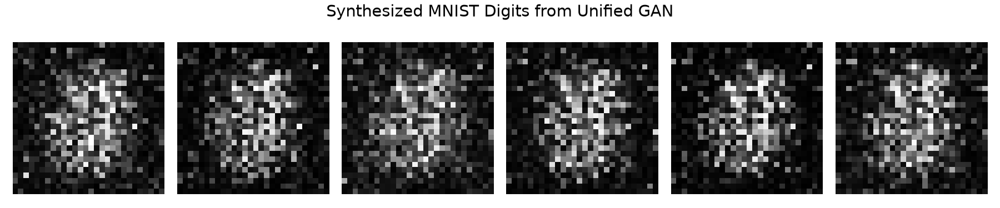

# Generative Adversarial Networks (GAN)

This tutorial demonstrates how to build and train a Generative Adversarial Network (GAN) as a **single, unified model** using Taktiny.

By encapsulating both the **Generator** and **Discriminator** inside a single `taktiny.nn.Module`, you can train the entire adversarial system directly using `taktiny.trainer.Trainer`—matching the exact same workflow as supervised models.

You will learn how to:
1. Encapsulate Generator and Discriminator networks as sub-modules within a unified `GAN(nn.Module)`.
2. Load and preprocess real handwritten digits from Hugging Face `datasets` (MNIST) using `taktiny.data.DataLoader` and `Map`.
3. Formulate the combined minimax adversarial loss using `jax.lax.stop_gradient`.
4. Train the unified GAN model using `taktiny.trainer.Trainer`.
5. Sample and visualize newly synthesized digits using `matplotlib`.

---

## 1. Install Taktiny

If Taktiny isn't installed in your Python environment, you can install Taktiny from GitHub by using either pip or uv:

```bash
uv add -U git+https://github.com/solitariusai/taktiny.git@experiment
# or
# pip install -U git+https://github.com/solitariusai/taktiny.git@experiment
```

---

## 2. Import Packages

```python
import jax
import jax.numpy as jnp
import matplotlib.pyplot as plt
import numpy as np
import optax
from datasets import load_dataset

from taktiny import nn
from taktiny.data import Batch, DataLoader, Map
from taktiny.trainer import DatasetConfig, Trainer, TrainingConfig
```

---

## 3. Define the Unified GAN Model

In Taktiny, complex architectures can be composed cleanly by nesting sub-modules. We define `Generator` and `Discriminator` classes, then compose them into a single `GAN` model:

- The **Generator** maps a latent noise vector $z \sim \mathcal{N}(0, I)$ into a flattened image $\hat{x} \in [-1, 1]^{784}$ using `tanh`.
- The **Discriminator** receives an image vector $x \in \mathbb{R}^{784}$ and outputs an unnormalized scalar logit.
- The **`GAN`** module wraps both components and provides dedicated `.generate()` and `.discriminate()` methods.

```python
class Generator(nn.Module):
    """Maps latent noise vectors z to synthetic flattened image space."""
    def __init__(self, latent_dim: int, *, rngs: nn.Rngs):
        self.fc1 = nn.Linear(latent_dim, 256, rngs=rngs)
        self.fc2 = nn.Linear(256, 512, rngs=rngs)
        self.fc3 = nn.Linear(512, 784, rngs=rngs)

    def __call__(self, z: jax.Array) -> jax.Array:
        h = jax.nn.leaky_relu(self.fc1(z), negative_slope=0.2)
        h = jax.nn.leaky_relu(self.fc2(h), negative_slope=0.2)
        return jnp.tanh(self.fc3(h))

class Discriminator(nn.Module):
    """Classifies whether an input sample is real (1) or generated (0)."""
    def __init__(self, *, rngs: nn.Rngs):
        self.fc1 = nn.Linear(784, 512, rngs=rngs)
        self.fc2 = nn.Linear(512, 256, rngs=rngs)
        self.fc3 = nn.Linear(256, 1, rngs=rngs)

    def __call__(self, x: jax.Array) -> jax.Array:
        h = jax.nn.leaky_relu(self.fc1(x), negative_slope=0.2)
        h = jax.nn.leaky_relu(self.fc2(h), negative_slope=0.2)
        return self.fc3(h)

class GAN(nn.Module):
    """Unified GAN module containing both Generator and Discriminator."""
    def __init__(self, latent_dim: int, *, rngs: nn.Rngs):
        self.generator = Generator(latent_dim, rngs=rngs)
        self.discriminator = Discriminator(rngs=rngs)
        self.latent_dim = latent_dim

    def generate(self, z: jax.Array) -> jax.Array:
        return self.generator(z)

    def discriminate(self, x: jax.Array) -> jax.Array:
        return self.discriminator(x)

# Initialize the unified model with a seeded PRNG state
rngs = nn.Rngs(42)
model = GAN(latent_dim=64, rngs=rngs)

print(model)
```

```
GAN (1.08M, 4.13 MB)
├── generator: Generator (550.42K, 2.1 MB)
│   ├── fc1: Linear(64 ➤ 256) (16.64K, 65 KB)
│   │   ├── kernel: f32[64, 256]
│   │   └── bias: f32[256]
│   ├── fc2: Linear(256 ➤ 512) (131.58K, 514 KB)
│   │   ├── kernel: f32[256, 512]
│   │   └── bias: f32[512]
│   └── fc3: Linear(512 ➤ 784) (402.19K, 1.53 MB)
│       ├── kernel: f32[512, 784]
│       └── bias: f32[784]
└── discriminator: Discriminator (533.5K, 2.04 MB)
    ├── fc1: Linear(784 ➤ 512) (401.92K, 1.53 MB)
    │   ├── kernel: f32[784, 512]
    │   └── bias: f32[512]
    ├── fc2: Linear(512 ➤ 256) (131.33K, 513 KB)
    │   ├── kernel: f32[512, 256]
    │   └── bias: f32[256]
    └── fc3: Linear(256 ➤ 1) (257, 1 KB)
        ├── kernel: f32[256, 1]
        └── bias: f32[1]
```

---

## 4. Load the Dataset

We load the real **MNIST** dataset from Hugging Face `datasets`. Because the Generator uses `tanh` as its output activation, pixel values are normalized to `[-1.0, 1.0]` and flattened into vectors of size `784`:

```python
# Load MNIST dataset
raw_train = load_dataset("ylecun/mnist", split="train")

# Normalize PIL images to [-1.0, 1.0] and flatten to (784,)
def preprocess(item: dict) -> dict[str, np.ndarray]:
    img = np.array(item["image"], dtype=np.float32) / 127.5 - 1.0
    return {"x": img.reshape(784)}

# Build DataLoader with mapping and batching
train_loader = DataLoader(
    raw_train,
    operations=[Map(preprocess), Batch(batch_size=64)],
)
```

---

## 5. Formulate the Combined Adversarial Loss

In standard GAN optimization, the Discriminator and Generator have competing objectives. Using `jax.lax.stop_gradient`, we combine both objectives into a single loss function:

1. **Discriminator Objective ($L_D$)**:

$$\min_{\theta_D} \left[ \text{BCE}(D(x_{\text{real}}), 1) + \text{BCE}(D(\text{stop\_gradient}(G(z))), 0) \right]$$ 

Stopping gradients on $G(z)$ ensures the Generator does not receive gradient updates from $L_D$.

2. **Generator Objective ($L_G$)**:

$$\min_{\theta_G} \left[ \text{BCE}(\text{stop\_gradient}(D)(G(z)), 1) \right]$$ 

Stopping gradients on the Discriminator PyTree ensures the Discriminator parameters are frozen during the Generator's update, while still allowing gradients to backpropagate through $D$'s input into $G$.

```python
def gan_loss(model: GAN, batch: dict[str, jax.Array], *, rng: jax.Array) -> jax.Array:
    real_x = batch["x"]
    batch_size = real_x.shape[0]
    noise = jax.random.normal(rng, shape=(batch_size, model.latent_dim))

    # -------------------------------------------------------------
    # 1. Discriminator Loss: Update D, Freeze G
    # -------------------------------------------------------------
    fake_for_d = jax.lax.stop_gradient(model.generate(noise))
    d_real = model.discriminate(real_x)
    d_fake = model.discriminate(fake_for_d)

    loss_d = (
        optax.sigmoid_binary_cross_entropy(d_real, jnp.ones_like(d_real)).mean()
        + optax.sigmoid_binary_cross_entropy(d_fake, jnp.zeros_like(d_fake)).mean()
    )

    # -------------------------------------------------------------
    # 2. Generator Loss: Update G, Freeze D
    # -------------------------------------------------------------
    fake_for_g = model.generate(noise)
    frozen_d = jax.lax.stop_gradient(model.discriminator)
    d_fake_for_g = frozen_d(fake_for_g)

    loss_g = optax.sigmoid_binary_cross_entropy(
        d_fake_for_g, jnp.ones_like(d_fake_for_g)
    ).mean()

    return loss_d + loss_g
```

---

## 6. Training with `Trainer`

Because both networks live inside the single `GAN` model and the combined loss handles gradient routing, you can run training directly with `taktiny.trainer.Trainer`:

```python
training_config = TrainingConfig(
    max_steps=200,
    learning_rate=2e-4,
    optimizer=optax.adam(learning_rate=2e-4, b1=0.5),
    log_interval=50,
)

dataset_config = DatasetConfig(
    train_dataloader=train_loader,
)

trainer = Trainer(
    model=model,
    training_config=training_config,
    dataset_config=dataset_config,
    loss_fn=gan_loss,
)

trainer.train()
```

---

## 7. Generating Samples and Visualization

After training, switch the model to evaluation mode and use `jax.jit` directly on `model.generate` for fast, compiled inference:

```python
# Switch model to evaluation mode
model.eval()
jit_generator = jax.jit(model.generate)

# Sample 6 latent noise vectors
eval_key = jax.random.key(123)
eval_noise = jax.random.normal(eval_key, shape=(6, model.latent_dim))

# Generate and rescale from [-1, 1] to [0, 1]
generated = jit_generator(eval_noise)
generated = (generated + 1.0) / 2.0
generated_images = generated.reshape(6, 28, 28)

# Plot generated samples
fig, axs = plt.subplots(1, 6, figsize=(12, 2.5))
for i in range(6):
    axs[i].imshow(generated_images[i], cmap="gray")
    axs[i].axis("off")

fig.suptitle("Synthesized MNIST Digits from Unified GAN", fontsize=14)
plt.tight_layout()
plt.show()
```

You should see something like this:


