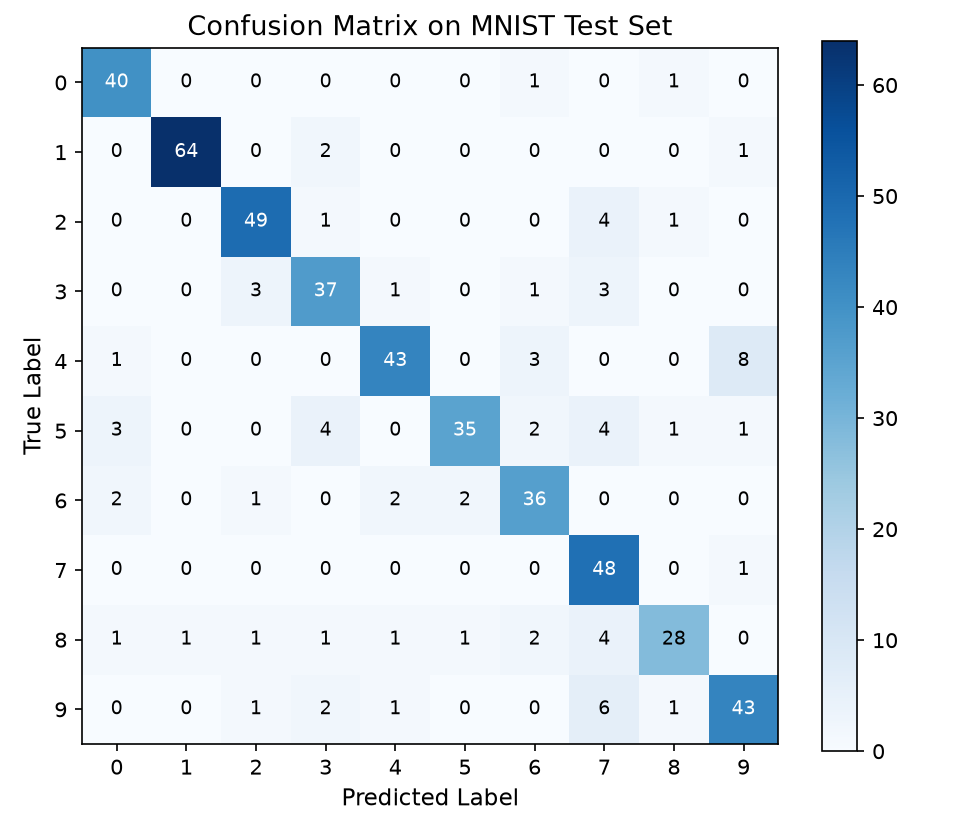
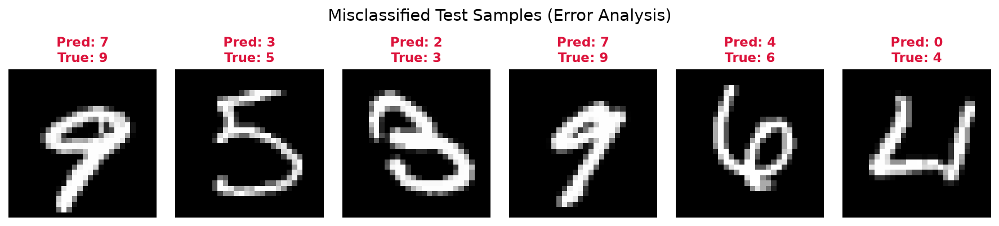

# Image Classification

This tutorial guides you through building, training, and evaluating a Convolutional Neural Network (CNN) on real image data with Taktiny.

You will learn how to:
1. Construct a CNN architecture using `taktiny.nn.Conv`, `MaxPool`, `ReLU`, `Flatten`, `Dropout`, and `Linear`.
2. Load real handwritten digits from Hugging Face `datasets` (MNIST) and preprocess them into channels-last (`NHWC`) arrays using `taktiny.data.DataLoader` and `Map`.
3. Train the network using `taktiny.trainer.Trainer` with categorical cross-entropy loss.
4. Evaluate test accuracy and compute the multi-class Confusion Matrix across all digits.
5. Perform Error Analysis to locate and visualize which specific images were misclassified.

---

## 1. Install Taktiny

If Taktiny isn't installed in your Python environment, you can install Taktiny from GitHub by using either pip or uv:

```bash
uv add -U git+https://github.com/solitariusai/taktiny.git@experiment
# or
# pip install -U git+https://github.com/solitariusai/taktiny.git@experiment
```

---

## 2. Import Packages

```python
import jax
import jax.numpy as jnp
import matplotlib.pyplot as plt
import numpy as np
import optax
from datasets import load_dataset

from taktiny import nn
from taktiny.data import Batch, DataLoader, Map
from taktiny.trainer import DatasetConfig, Trainer, TrainingConfig
```

---

## 3. Define the Convolutional Neural Network

In Taktiny, models inherit from `taktiny.nn.Module`. `nn.Conv` natively expects channels-last inputs with format `(batch, height, width, channels)`.

Parameters are registered as JAX PyTree leaves, and PRNG streams are initialized with `taktiny.nn.Rngs`:

```python
class ConvNet(nn.Module):
    def __init__(self, in_channels: int, num_classes: int, *, rngs: nn.Rngs):
        # First conv block: (28, 28, 1) -> (28, 28, 16) -> (14, 14, 16)
        self.conv1 = nn.Conv(in_channels, 16, kernel_size=(3, 3), padding="SAME", rngs=rngs)
        self.act1 = nn.ReLU()
        self.pool1 = nn.MaxPool(kernel_size=(2, 2))

        # Second conv block: (14, 14, 16) -> (14, 14, 32) -> (7, 7, 32)
        self.conv2 = nn.Conv(16, 32, kernel_size=(3, 3), padding="SAME", rngs=rngs)
        self.act2 = nn.ReLU()
        self.pool2 = nn.MaxPool(kernel_size=(2, 2))

        # Fully connected head
        self.flatten = nn.Flatten(start_axis=1)
        self.dropout = nn.Dropout(p=0.1, rngs=rngs)
        self.fc = nn.Linear(32 * 7 * 7, num_classes, rngs=rngs)

    def __call__(self, x: jax.Array) -> jax.Array:
        x = self.pool1(self.act1(self.conv1(x)))
        x = self.pool2(self.act2(self.conv2(x)))
        x = self.flatten(x)
        x = self.dropout(x)
        return self.fc(x)

# Initialize network with seeded PRNG state
rngs = nn.Rngs(42)
model = ConvNet(in_channels=1, num_classes=10, rngs=rngs)
print(model)
```
```
ConvNet (20.49K, 80.04 KB)
├── conv1: Conv(1 ➤ 16, k=3×3, s=1×1) (160, 640 B)
│   ├── kernel: f32[3, 3, 1, 16]
│   └── bias: f32[16]
├── act1: ReLU (0, 0 B)
├── pool1: MaxPool(k=2×2, s=2×2, padding=((0, 0), (0, 0)), d=1×1, return_indices=False, ceil_mode=False) (0, 0 B)
├── conv2: Conv(16 ➤ 32, k=3×3, s=1×1) (4.64K, 18.12 KB)
│   ├── kernel: f32[3, 3, 16, 32]
│   └── bias: f32[32]
├── act2: ReLU (0, 0 B)
├── pool2: MaxPool(k=2×2, s=2×2, padding=((0, 0), (0, 0)), d=1×1, return_indices=False, ceil_mode=False) (0, 0 B)
├── flatten: Flatten(start_axis=1, end_axis=-1) (0, 0 B)
├── dropout: Dropout(p=0.1, broadcast_axes=()) (0, 0 B)
└── fc: Linear(1568 ➤ 10) (15.69K, 61.29 KB)
    ├── kernel: f32[1568, 10]
    └── bias: f32[10]
```

---

## 4. Load the Dataset

We load the real **MNIST** dataset from Hugging Face `datasets`. Images are converted to floating-point NumPy arrays normalized to `[0.0, 1.0]` with shape `(28, 28, 1)`:

```python
# Load train and test splits
raw_train = load_dataset("ylecun/mnist", split="train")
raw_test = load_dataset("ylecun/mnist", split="test")

# Preprocess PIL images to normalized channels-last arrays
def preprocess(item: dict) -> dict[str, np.ndarray]:
    img = np.array(item["image"], dtype=np.float32) / 255.0
    return {
        "image": np.expand_dims(img, axis=-1),
        "label": np.int32(item["label"]),
    }

# Build DataLoaders with mapping and batching operations
train_loader = DataLoader(
    raw_train,
    operations=[Map(preprocess), Batch(batch_size=64)],
)

val_loader = DataLoader(
    raw_test,
    operations=[Map(preprocess), Batch(batch_size=64)],
)
```

---

## 5. Training with `Trainer`

### Define Multi-Class Cross-Entropy Loss
The loss function receives the model instance and batch dictionary, returning a scalar loss:

```python
def loss_fn(m: ConvNet, batch: dict[str, jax.Array]) -> jax.Array:
    logits = m(batch["image"])
    loss = optax.softmax_cross_entropy_with_integer_labels(
        logits=logits,
        labels=batch["label"],
    )
    return jnp.mean(loss)
```

### Configure and Run the Trainer
```python
training_config = TrainingConfig(
    max_steps=100,
    learning_rate=1e-3,
    log_interval=20,
    eval_strategy="steps",
    eval_steps=50,
)

dataset_config = DatasetConfig(
    train_dataloader=train_loader,
    validation_dataloader=val_loader,
)

trainer = Trainer(
    model=model,
    training_config=training_config,
    dataset_config=dataset_config,
    loss_fn=loss_fn,
)

trainer.train()
```

---

## 6. Evaluate Model Performance

Evaluate classification accuracy and collect predictions across the validation set:

```python
# Switch model to evaluation mode (disables dropout)
model.eval()
jit_model = jax.jit(model)

all_images = []
all_preds = []
all_labels = []

for batch in val_loader:
    logits = jit_model(batch["image"])
    preds = jnp.argmax(logits, axis=-1)
    all_images.append(np.array(batch["image"]))
    all_preds.append(np.array(preds))
    all_labels.append(np.array(batch["label"]))

all_images = np.concatenate(all_images)
all_preds = np.concatenate(all_preds)
all_labels = np.concatenate(all_labels)

accuracy = 100.0 * np.mean(all_preds == all_labels)
print(f"Validation Accuracy: {accuracy:.2f}%")
```

---

## 7. Confusion Matrix

A Confusion Matrix provides an overview of which classes the network confuses (e.g. distinguishing 4s from 9s, or 3s from 5s):

```python
num_classes = 10
cm = np.zeros((num_classes, num_classes), dtype=int)
for t, p in zip(all_labels, all_preds):
    cm[t, p] += 1

fig, ax = plt.subplots(figsize=(6.5, 5.5))
im = ax.imshow(cm, cmap="Blues", interpolation="nearest")
fig.colorbar(im, ax=ax)

ax.set_xticks(range(num_classes))
ax.set_yticks(range(num_classes))
ax.set_xlabel("Predicted Label", fontsize=11)
ax.set_ylabel("True Label", fontsize=11)
ax.set_title("Confusion Matrix on MNIST Test Set", fontsize=13)

# Annotate cells with sample counts
for i in range(num_classes):
    for j in range(num_classes):
        color = "white" if cm[i, j] > cm.max() / 2 else "black"
        ax.text(j, i, str(cm[i, j]), ha="center", va="center", color=color, fontsize=9)

plt.tight_layout()
plt.show()
```

You should see something like this:



---

## 8. Error Analysis: Inspecting Misclassified Images

To understand why errors occur, filter the test samples where `all_preds != all_labels` and visualize the specific digits the model got wrong:

```python
# Locate indices where predictions do not match ground-truth
wrong_indices = np.where(all_preds != all_labels)[0]
print(f"Total misclassified test images: {len(wrong_indices)}")

# Visualize the first 6 misclassified samples
fig, axs = plt.subplots(1, 6, figsize=(12, 2.5))
for i in range(min(6, len(wrong_indices))):
    idx = wrong_indices[i]
    axs[i].imshow(all_images[idx].squeeze(), cmap="gray")
    axs[i].set_title(
        f"Pred: {all_preds[idx]}\nTrue: {all_labels[idx]}",
        color="crimson",
        fontsize=11,
        fontweight="bold",
    )
    axs[i].axis("off")

fig.suptitle("Misclassified Test Samples (Error Analysis)", fontsize=14, y=1.05)
plt.tight_layout()
plt.show()
```

You should see something like this:



