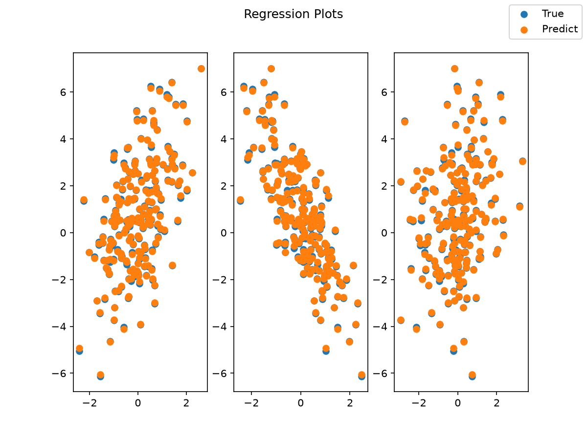

# Linear Regression

This tutorial guides you through building and training a linear regression model with Taktiny.

You will learn how to:
1. Construct a linear model using `taktiny.nn.Linear`.
2. Generate synthetic data and batch it with `taktiny.data.DataLoader`.
3. Train the model using `taktiny.trainer.Trainer` with Mean Squared Error (MSE).
4. Inspect learned parameters (`kernel` and `bias`).

---

## 1. Install Taktiny

If Taktiny isn't installed in your Python environment, you can install Taktiny from GitHub by using either pip or uv

```bash
uv add -U git+https://github.com/solitariusai/taktiny.git@experiment
# or
# pip install -U git+https://github.com/solitariusai/taktiny.git@experiment
```

---

## 2. Import Packages

```python
import jax
import jax.numpy as jnp
import matplotlib.pyplot as plt

from taktiny import nn
from taktiny.data import Batch, DataLoader, train_validation_split
from taktiny.trainer import DatasetConfig, Trainer, TrainingConfig
```

---

## 3. Define the Regression Model

In Taktiny, models inherit from `taktiny.nn.Module`. Every weight is a `taktiny.nn.Parameter` registered as a JAX PyTree leaf.

```python
class LinearRegression(nn.Module):
    def __init__(self, in_features: int, out_features: int = 1, *, rngs: nn.Rngs):
        self.linear = nn.Linear(in_features, out_features, rngs=rngs)

    def __call__(self, x: jax.Array) -> jax.Array:
        return self.linear(x)

# Initialize with a seeded PRNG state
rngs = nn.Rngs(42)
model = LinearRegression(in_features=3, out_features=1, rngs=rngs)
```

---

## 4. Generating Synthetic Data

We generate synthetic points with a known linear relation: $y = X w + b + \epsilon$. Note that rngs is callable and returns a new [PRNG key](https://chatgpt.com/c/6aa02b05-da18-83ec-84ad-16f5bc424bf2) on each call, so you can continue using rngs() after model initialization. 

```python
# Ground-truth weights and bias
true_w = jnp.array([[1.5], [-2.0], [0.5]])
true_b = 0.8

# Generate 200 random points in R^3
n_samples = 200
xs = jax.random.normal(rngs(), (n_samples, 3))
noise = 0.05 * jax.random.normal(rngs(), (n_samples, 1))
ys = xs @ true_w + true_b + noise

# Package as a list of records
dataset = [{"x": xs[i], "y": ys[i]} for i in range(n_samples)]

# Train-validation split
train_data, val_data = train_validation_split(dataset, validation_size=0.2, seed=42)

# Build DataLoaders
train_loader = DataLoader(train_data, operations=[Batch(batch_size=16)])
val_loader = DataLoader(val_data, operations=[Batch(batch_size=16)])
```

---

## 5. Training with `Trainer`

### Define Mean Squared Error Loss
The loss function receives the model instance and batch dictionary:

```python
def mse_loss(m: LinearRegression, batch: dict[str, jax.Array]) -> jax.Array:
    predictions = m(batch["x"])
    targets = batch["y"]
    return jnp.mean((predictions - targets) ** 2)
```

### Configure and Run the Trainer
```python
training_config = TrainingConfig(
    max_steps=100,
    learning_rate=0.05,
    log_interval=10,
    eval_strategy="steps",
    eval_steps=25,
)

dataset_config = DatasetConfig(
    train_dataloader=train_loader,
    validation_dataloader=val_loader,
)

trainer = Trainer(
    model=model,
    training_config=training_config,
    dataset_config=dataset_config,
    loss_fn=mse_loss,
)

trainer.train()
```

---

## 6. Inspect Learned Parameters

After training, access the learned parameters directly:

```python
print("True kernel:    [1.5, -2.0, 0.5]")
print("Learned kernel:", model.linear.kernel.value.squeeze())
print("True bias:      0.8")
print("Learned bias:  ", float(model.linear.bias.value.squeeze()))
```

---

## 7. Functional Inference

You can use `jax.jit` directly to the model instance for compiled inference:

```python
sample = jnp.array([[1.0, 1.0, 1.0]])
jit_model = jax.jit(model)
pred = jit_model(sample)
print("Prediction for [1, 1, 1]:", float(pred[0, 0]))
```

---

## 8. Visualization

Plot the target and model predictions against each input feature using `matplotlib`.

```python
fig, axs = plt.subplots(1, 3, figsize=(8, 6))

pred = jit_model(xs)

for i in range(3):
    axs[i].scatter(xs[:, i], ys.squeeze(), label='True')
    axs[i].scatter(xs[:, i], pred.squeeze(), label='Predict')

fig.legend(*axs[0].get_legend_handles_labels())
fig.suptitle("Regression Plots")

plt.show()
```

You should see something like this.

